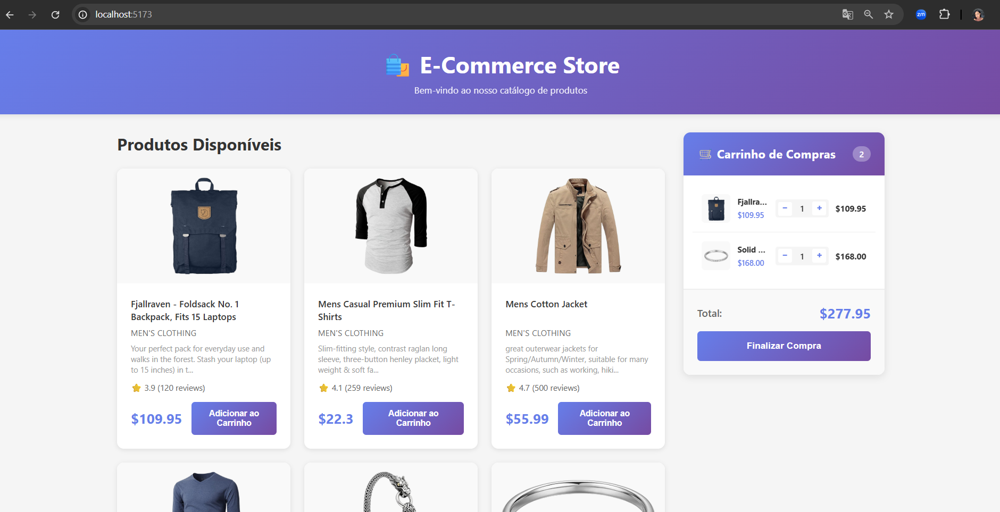

# Product List React Challenge



Projeto desenvolvido em React para praticar conceitos fundamentais como componentes, props, renderização de listas e gerenciamento de estado.

## Objetivo

Exibir uma lista de produtos contendo:

* Nome do produto
* Preço
* Botão para adicionar ao carrinho

Carrinho de compras com:

* Controle de quantidade por produto
* Incremento automático quando o item já existir no carrinho
* Cálculo do valor total da compra

## Tecnologias

* React
* JavaScript (ES6+)
* Vite

## Funcionalidades Implementadas

* Renderização dinâmica da lista de produtos
* Componentização com ProductCard e ProductList
* Comunicação entre componentes através de props
* Evento de adição ao carrinho preparado para implementação futura

## Como executar

```bash
npm install
npm run dev
```
